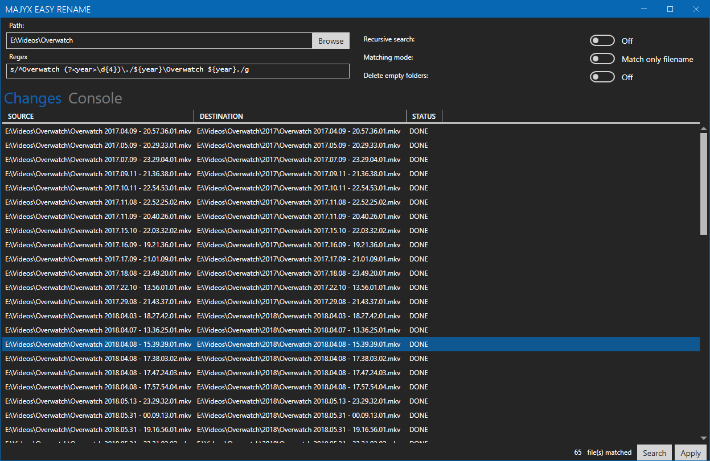

# MaJyx Easy Rename

MaJyx Easy Rename, MER for short, is a tool to help you manage and organize a huge library of files
by doing Regular Expression matching and replace with a [`sed`](https://www.commandlinux.com/man-page/man1/sed.1.html) like syntaxe.

## Getting started

* .NET SDK 4.7.1 superior or equal
* CSharp IDE ([Visual Studio Community](https://visualstudio.microsoft.com/fr/) recommended)

## Code of Conduct

See our [Code of Conduct](CODEOFCONDUCT.md)

## License

This project is under [MIT license](LICENSE)